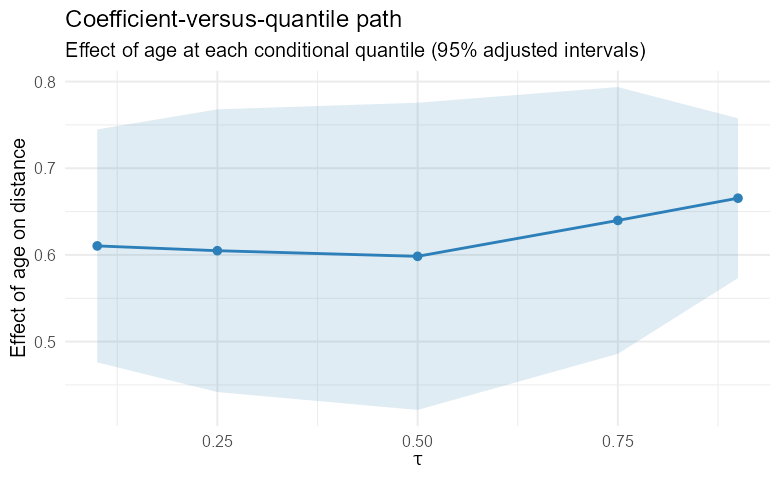
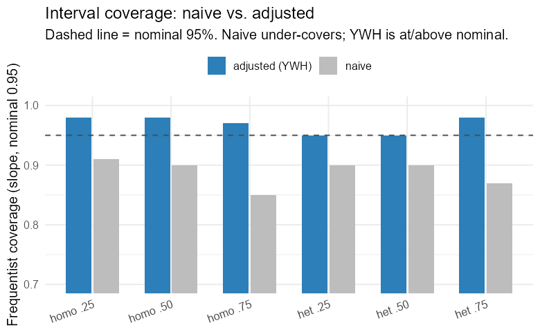
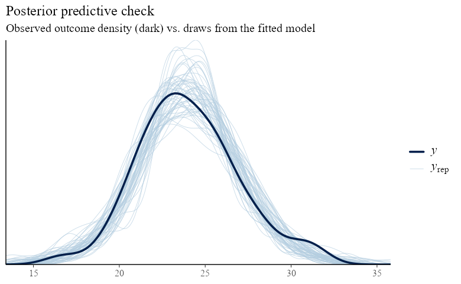

```{r, include = FALSE}
knitr::opts_chunk$set(collapse = TRUE, comment = "#>", eval = FALSE)
```

This primer is written for applied researchers who have data, a question about
how a *predictor relates to the distribution of an outcome*, and clustered or
repeated measurements. It explains what Bayesian multilevel quantile regression
is, when to reach for it, how to fit and interpret models with **bqmm**, and —
just as important — how to check that the answer can be trusted. You do not need
prior exposure to quantile regression or to Stan. Equations appear, but each is
introduced in words first.

# 1. Why model quantiles?

Most regression you have met models the **mean** of an outcome: "on average, a
one-unit change in *x* moves *y* by β." That is often the wrong summary. Three
situations recur in practice.

* **The spread changes.** In growth, income, or biomarker data the *variability*
  of the outcome grows with a predictor. A mean model reports one slope; the
  reality is that the 90th percentile rises far faster than the 10th.
* **The tails are the point.** Clinicians care about the patients at the high end
  of a risk marker, not the average patient; ecologists care about minimum
  river flow, not mean flow. These are questions about *quantiles*.
* **The effect is distributional.** A treatment may not shift everyone equally —
  it may compress the bottom of the distribution while leaving the top alone.

**Quantile regression** [@koenker2005] answers these directly. Instead of the
mean, it models a chosen conditional quantile — the median (τ = 0.5), the 10th
percentile (τ = 0.1), the 90th (τ = 0.9), or a whole grid of them. The
coefficient β(τ) is read as: "a one-unit change in *x* moves the τ-th
*percentile* of *y* by β(τ)." Sweeping τ from 0 to 1 traces how a predictor
reshapes the entire conditional distribution, not just its center.

## Why multilevel?

Real data are rarely a single exchangeable sample. Patients are nested in
hospitals; measurements are repeated within subjects; students are crossed with
schools and neighbourhoods. Ignoring this structure understates uncertainty and
discards information. **Multilevel (mixed-effects)** models add *random effects*
— cluster-specific deviations drawn from a common distribution — so that each
cluster borrows strength from the others while keeping its own signature.

## Why Bayesian?

A Bayesian treatment delivers full posterior uncertainty for every quantity
(fixed effects, variance components, predictions), handles the hierarchical
shrinkage coherently, and lets you encode prior knowledge. It also comes with
one subtlety specific to quantile regression — the likelihood is a *working*
approximation — which Section 6 treats carefully. `bqmm` is built so that the
default settings handle that subtlety for you.

# 2. The model in one page

Write the τ-th conditional quantile of the outcome for observation *i* in
cluster *j* as a linear predictor with fixed and random parts:

$$
Q_\tau(y_{ij} \mid x_{ij}, u_j) \;=\; x_{ij}^\top \beta(\tau) \;+\; z_{ij}^\top u_j .
$$

Here `β(τ)` are the **fixed effects** at quantile τ (shared across clusters) and
`u_j` are the **random effects** for cluster *j*, drawn from a mean-zero normal,
`u_j ~ N(0, Σ)`. The design vectors `x` and `z` are built from your formula —
in `bqmm` you write `y ~ x + (1 + x | g)` exactly as in `lme4`.

**The estimation trick.** Classical quantile regression minimises the *check
loss* `ρ_τ(u) = u(τ − 1{u < 0})`. There is no obvious likelihood to be Bayesian
about — until you notice that minimising the check loss is *equivalent* to
maximising the likelihood of the **asymmetric Laplace distribution** (ALD)
[@yu2001]. So `bqmm` uses the ALD as a *working likelihood*:

$$
y_{ij} \mid \cdot \;\sim\; \mathrm{ALD}\big(\mu_{ij},\, \sigma,\, \tau\big),
\qquad \mu_{ij} = x_{ij}^\top\beta + z_{ij}^\top u_j ,
$$

with a scale `σ > 0`. The mode/`τ`-quantile of this density sits exactly at the
linear predictor, which is why fitting it recovers the quantile regression
estimate. Priors complete the model: weakly-informative normals on `β`,
half-normals on `σ` and the random-effect SDs, and (for correlated random
effects) an LKJ prior on the correlation matrix. `bqmm` scales these defaults to
your data so you rarely need to touch them.

> **Key idea.** The ALD is a *device*, not a belief about your errors. It makes
> the quantile estimate computable in a Bayesian framework. Section 6 explains
> the one place this matters — uncertainty — and how `bqmm` corrects for it.

# 3. Your first model

We use the orthodontic growth data (`nlme::Orthodont`): the distance from the
pituitary to the pterygomaxillary fissure, measured repeatedly on 27 children.
Measurements are nested within `Subject`.

```{r}
library(bqmm)
data(Orthodont, package = "nlme")

fit <- bqmm(distance ~ age + (1 | Subject),
            data = Orthodont,
            tau  = 0.5)          # the conditional median

summary(fit)
```

`summary()` reports the fixed effects with their **Yang–Wang–He–adjusted**
intervals (Section 6), the random-effect standard deviations, and convergence
notes. The familiar accessors all work:

```{r}
fixef(fit)        # population-level coefficients at tau = 0.5
ranef(fit)        # subject-specific deviations
VarCorr(fit)      # random-effect SDs (and correlations, if any)
coef(fit)         # fixed effects
predict(fit)      # fitted conditional medians
```

# 4. Many quantiles at once

The power of quantile regression is comparison *across* τ. Pass a vector:

```{r}
fit_q <- bqmm(distance ~ age + (1 | Subject),
              data = Orthodont,
              tau  = c(0.1, 0.25, 0.5, 0.75, 0.9))

coef(fit_q)   # a tau-by-coefficient matrix
plot(fit_q)   # coefficient-versus-tau paths
```

The coefficient path shows how the age effect changes across the distribution of
growth. If the slope rises with τ, older children's *upper* percentiles grow
faster than their lower ones — a fanning-out the mean model cannot express.

```{r, echo = FALSE, eval = TRUE, out.width = "70%", fig.cap = "Coefficient-versus-quantile path: the estimated effect of a predictor at each quantile, with uncertainty. A non-flat path is distributional information a mean model discards."}

```

**Non-crossing.** Fitted quantile curves estimated separately can cross, which
is logically impossible (the 10th percentile cannot exceed the 90th). `bqmm`
offers a post-hoc fix — sorting the fitted values across τ [@chernozhukov2010]:

```{r}
predict(fit_q, noncrossing = "rearrange")
```

# 5. Priors and the scale parameter

The defaults are weakly informative and scaled to your response, chosen to keep
the sampler stable rather than to inject information. Override any of them with
`bqmm_prior()`:

```{r}
my_prior <- bqmm_prior(
  beta_sd     = 5,    # SD of the normal prior on fixed effects
  sigma_scale = 1,    # half-normal scale for the ALD scale sigma
  re_scale    = 2,    # half-normal scale for random-effect SDs
  lkj         = 2     # LKJ shape (correlated REs only)
)
fit <- bqmm(distance ~ age + (1 | Subject), Orthodont,
            tau = 0.5, prior = my_prior)
```

The ALD scale `σ` is a nuisance parameter of the working likelihood. It governs
the spread of the working density but is **not** the residual SD of your data,
and you should not interpret it as such. Its main job is to be marginalised over;
`bqmm`'s inference correction (next) removes any dependence of the *reported*
uncertainty on the precise value of `σ`.

# 6. Getting the uncertainty right

This is the most important section. Because the ALD is a *working* likelihood,
the naive Bayesian posterior covariance of the fixed effects is **not** the
correct sampling variance of the quantile-regression estimator — credible
intervals built from it can badly under- or over-cover [@yang2016]. This is a
known, well-understood issue, and `bqmm` corrects for it by default.

The correction follows @yang2016: replace the naive posterior covariance with a
sandwich that re-uses the posterior covariance as its "bread" and a
score-variance "meat",

$$
V_{\mathrm{adj}} \;=\; \Sigma_{\text{post}}\; G\; \Sigma_{\text{post}},
$$

where `G` is the variance of the ALD working-likelihood score. Using the
posterior covariance as the bread is what makes this valid for *multilevel*
models: `Σ_post` already carries the random-effect contribution to fixed-effect
uncertainty, so the correction keeps it while fixing the misspecified scale. Under
correct specification the correction collapses to `≈ Σ_post`, as it should.

```{r}
vcov(fit, adjusted = TRUE)    # corrected (default)
vcov(fit, adjusted = FALSE)   # naive posterior covariance
confint(fit, adjusted = TRUE)
summary(fit)                  # uses the adjusted intervals
```

In simulation across homoscedastic and heteroscedastic two-level designs, the
adjusted intervals cover at or just above the nominal 95%, whereas the naive
intervals under-cover the slopes; see `vignette("bqmm-inference")` and the
package's review report. The take-away for practice:

> **Report `adjusted = TRUE` intervals** unless you have a specific reason not
> to. They are the package's reason to exist over a generic ALD fit.

```{r, echo = FALSE, eval = TRUE, out.width = "70%", fig.cap = "Frequentist coverage of nominal-95% intervals across simulated designs: the naive posterior under-covers; the Yang--Wang--He--adjusted intervals are at or above nominal."}

```

# 7. Correlated random effects

A random intercept *and* slope are usually correlated — children who start tall
may also grow faster. Model that correlation with `cov = "unstructured"`:

```{r}
fit_c <- bqmm(distance ~ age + (1 + age | Subject),
              data = Orthodont, tau = 0.5,
              cov  = "unstructured")

VarCorr(fit_c)                       # SDs plus...
attr(VarCorr(fit_c), "correlation")  # the posterior-median correlation matrix
```

An LKJ prior (default shape 2, mildly favouring weak correlation) regularises the
correlation. Two cautions:

* The covariance is **only weakly identified when the random effects are small
  relative to the noise**, or when there are few clusters. If the estimated SDs
  or correlation look shrunk toward zero, you likely lack the information to
  estimate them — not a bug. Prefer many clusters.
* `cov = "unstructured"` currently supports a **single** grouping factor. For
  multiple or crossed terms, use `cov = "diagonal"` (the default).

# 8. Diagnostics: is the fit trustworthy?

A posterior you cannot trust is worse than no posterior. Always check:

**Sampler convergence.** `bqmm` surfaces warnings automatically — split-R̂ above
1.01, low effective sample size, or divergent transitions. Treat any of these as
a stop sign. The usual fixes:

```{r}
fit <- bqmm(distance ~ age + (1 | Subject), Orthodont, tau = 0.5,
            chains = 4, iter = 4000,
            control = list(adapt_delta = 0.99, max_treedepth = 12))
```

Raising `adapt_delta` toward 0.99 and increasing `iter` cures most divergences
and low-ESS warnings; variance and correlation parameters are the slowest to mix
and benefit most. Inspect them with the `posterior` and `bayesplot` ecosystems:

```{r}
library(posterior)
summarise_draws(as_draws(fit))            # R-hat, ESS per parameter

library(bayesplot)
mcmc_trace(as_draws(fit), regex_pars = "b_")
```

**Posterior predictive checks.** Does the fitted model generate data that look
like yours? Overlay replicated datasets on the observed outcome:

```{r}
yrep <- posterior_predict(fit)            # draws x observations
bayesplot::ppc_dens_overlay(Orthodont$distance, yrep[1:50, ])
```

```{r, echo = FALSE, eval = TRUE, out.width = "70%", fig.cap = "Posterior predictive check: the observed outcome density (dark) against draws from the fitted model (light). Systematic mismatch flags a misfit the quantile of interest may not capture."}

```

**Non-crossing.** When fitting several τ, confirm the fitted quantiles are
monotone (or enforce it with `noncrossing = "rearrange"`).

# 9. Visualising results

Three plots carry most of the message:

1. **Coefficient-versus-τ paths** (`plot()` on a multi-quantile fit) — the
   headline distributional story.
2. **Fitted quantile curves** over a predictor grid, optionally rearranged, to
   show the conditional distribution fanning across the data.
3. **Posterior predictive overlays** (`ppc_dens_overlay`) and parameter
   intervals (`bayesplot::mcmc_areas(as_draws(fit))`) for fit and uncertainty.

Because `as_draws()` exposes the fit to the whole `posterior`/`bayesplot` stack,
any plot in those packages is available with tidy parameter names
(`b_<coef>`, `sd_<component>`, `sigma`).

# 10. Practical guidance and pitfalls

* **Clusters, not just observations.** Random-effect variances and correlations
  need *many groups* (rule of thumb: ≥ 20–30) to be estimable. A handful of
  large clusters is not enough.
* **Extreme quantiles need more data.** τ = 0.05 or 0.95 are estimated from the
  sparse tail; expect wider intervals and harder sampling. Raise `adapt_delta`.
* **Scale your predictors.** Centring and scaling continuous predictors improves
  sampling geometry and makes priors easier to set.
* **Diagonal vs unstructured.** Start with `cov = "diagonal"`. Move to
  `"unstructured"` only when you have one grouping factor, enough clusters, and a
  substantive reason to expect correlated random effects.
* **`cores > 1`** parallelises chains; on some systems the package must be on the
  default library path for the parallel workers to find it. `cores = 1` always
  works.
* **Report** the quantile(s) modelled, the adjusted intervals, the random-effect
  SDs (and correlations), and your convergence diagnostics.

# 11. How bqmm relates to other tools

* **`lqmm`, `qrLMM`** — frequentist quantile mixed models; excellent point
  estimation, no posterior. `bqmm`'s fixed-effect estimates agree closely with
  `lqmm`.
* **`brms` (`asym_laplace`)** — can fit a multilevel ALD model, but with a fixed
  quantile, an awkward scale, and *uncorrected* (invalid) intervals. `bqmm`'s
  reason to exist is the corrected inference and a quantile-first interface.
* **`bayesQR`, `Brq`** — Bayesian quantile regression without random effects.

# References
